<h1 align="center">Mushfiq Azam</h1>

<em>AI &amp; Machine Learning Enthusiast · ECE Undergraduate · Computer Vision • NLP • Deep Learning</em>

  
  

<table align="center">
  <tr>
    <td valign="top"></td>
    <td valign="top"></td>
  </tr>
</table>

<h3 align="center">Tech Stack</h3>

  
  
  
  
  
  
  

  
  
  
  
  
  
  
  

---

### About

I'm Mushfiq Azam, a final-year Electrical &amp; Computer Engineering student at
North South University, Bangladesh. I'm passionate about Artificial Intelligence,
Machine Learning, Computer Vision, and Natural Language Processing. I enjoy
building intelligent systems that solve real-world problems — from deep learning
research to full-stack AI applications. Currently focused on semantic
segmentation, NLP, and AI-powered financial technology while continuously
learning modern AI frameworks.

<h3 align="center">Find me</h3>

  
  
  
  

Contribution graph auto-refreshes daily via GitHub Actions.
